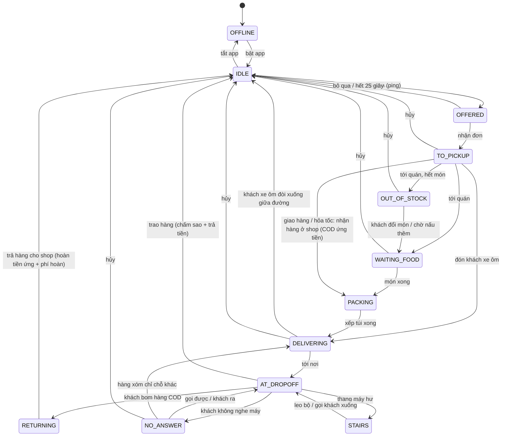

# Shipper Simulation – Tài liệu thiết kế (bản chơi được đầu tiên)

Bản mô tả gốc yêu cầu Unity/C#. Bản này làm **đúng các hệ thống đó bằng JavaScript + Three.js** (WebGL 2), chạy trong trình duyệt. File này thay cho 3 đầu việc của bản mô tả: (1) sơ đồ trạng thái + kiến trúc `OrderManager` / `DeliveryAppUI`, (2) lõi `ItemPhysics` + `OrderCondition`, (3) bảng chỉ số xe và túi.

---

## 1. Vòng chơi

```
Bật app → Có đơn (Y nhận / N bỏ) → Chạy tới quán → Chờ quán (xếp hàng / hết món)
→ Xếp túi (mini-game) → Chạy giao (ổ gà, kẹt xe, chó, CSGT, mưa) → Sự cố ở điểm giao
(địa chỉ mơ hồ, khách không nghe máy, thang máy hư) → Trao hàng → Chấm sao + Hóa đơn
```

- **Chơi tự do 24h** (đồng hồ chạy liên tục, `src/sim/clock.js`): không có "thắng"; ngày mới bắt đầu lúc 06:00 (tự lưu). App nhận đơn 06:00–24:00 (`apps.json → hours`).
- **Tiền nhà theo kỳ:** mỗi 3 ngày trả một lần, hạn 22:00 ngày cuối kỳ (kỳ 1: 1.000k, mỗi kỳ +200k — số tạm, chỉnh ở thẻ ⚖️). Trả sớm lúc nào cũng được. Trễ lần 1: phạt 20%, nợ dồn kỳ sau; trễ 2 lần liên tiếp → bị đuổi.
- **Ngủ** ở phòng trọ (2/4/6/8 tiếng hoặc tới 06:00): hồi 12 thể lực + 10 tinh thần mỗi giờ, app tự tắt, tự lưu khi dậy. Thức > 16 tiếng → hao ×2, > 22 tiếng → ×3.
- **Kiệt sức** (thể lực / tinh thần về 0) không thua: hủy đơn đang chạy, về phòng trọ nằm 6 tiếng; ngất mất 100k tiền thuốc.
- **Thua:** bị đuổi khỏi phòng (trễ tiền nhà 2 lần liên tiếp) · điểm đánh giá < 4.0 (khóa tài khoản). Màn hình thua: chơi lại từ lần lưu gần nhất / chơi mới.
- **Ràng buộc mở khóa:** xăng → mới chạy được · Túi giữ nhiệt → đơn trà sữa/kem · Mũ cho khách → đơn xe ôm → nhiệm vụ chiếc ví · Áo mưa → hết bị phạt khi mưa · tiền → xe tốt hơn.
- **Chuỗi manh mối:**
  - *Chiếc ví* (nhiệm vụ phụ): khách xe ôm bỏ quên ví → CMND ghi "cổng xanh, cạnh tạp hóa Cô Ba" → hỏi người đi đường → Cô Ba chỉ hẻm 42 → mẹ anh Minh nói anh ở quán cà phê → trả ví (+150k) **hoặc** lấy 300k (bị khiếu nại: −100k, thêm 3 đánh giá 1★).
  - *Địa chỉ mơ hồ:* chỉ có vòng tím → gọi khách hoặc hỏi người đi đường trong vòng để biết đúng nhà.
  - *Khách không nghe máy:* gọi lại / chờ / hỏi hàng xóm → khách đang ở chỗ khác → đổi điểm giao.

## 2. Máy trạng thái `OrderManager` (`src/sim/OrderManager.js`)



- Bảng chuyển hợp lệ nằm trong `TRANSITIONS`; chuyển sai sẽ báo lỗi (có bộ thử kiểm tra).
- Phát sự kiện: `offer`, `offerExpired`, `accepted`, `pickedUp`, `revealed`, `redirect`, `completed`, `cancelled`, `state`.
- Hoàn toàn **không phụ thuộc Three.js/DOM** → chạy được trong Node (bộ thử và bot mô phỏng dùng chính lớp này).

### `DeliveryAppUI` (`src/ui/phone.js`)
Điện thoại GoShip có 5 thẻ: **Đơn** (thẻ đơn mới có đếm ngược, các bước của đơn đang chạy, tình trạng từng món, nút Gọi khách / Hủy đơn) · **Bản đồ** (tên đường, kẹt xe, CSGT đã biết) · **Nhóm** (tin nhắn Hội Shipper: dự báo mưa, chốt CSGT, kẹt xe, mẹo) · **Ví** (thu/chi, đơn gần đây, điểm) · **Túi đồ**. Giao diện chỉ đọc ảnh chụp trạng thái và gửi hành động về `interactions.js`; không giữ logic.

## 3. Vật lý món hàng & chấm điểm

`src/sim/ItemPhysics.js`: mỗi `DeliveryItem` ghép các **đặc tính** (component):

| Đặc tính | Theo thời gian | Sự kiện từ xe |
|---|---|---|
| 🔥 Hot | nguội về nhiệt độ ngoài trời, hệ số `0.035·(1−0.8·giữ nhiệt)`; dưới 60°C mất điểm | – |
| ❄️ Cold | ấm lên theo nhiệt độ + nắng, hệ số `0.03·(1−giữ nhiệt)`; quá ngưỡng tan thì mất điểm | – |
| 💧 Liquid | – | xóc `12·mag·(1−0.7·giảm xóc)`, phanh `8·mag`, ôm cua `5·mag`, va chạm `15·mag`; ×2,5 nếu để nghiêng; đệm túi giảm 40% |
| ⚠️ Fragile | – | va chạm `28·mag`, xóc `5·mag`, phanh `4·mag`; đệm túi giảm 60%; bị đè khi xếp túi −30% |
| 📦 Paper | mưa mà túi không chống nước: −0,5%/phút | – |
| 🧍 Passenger | quá 40 km/h: `(v−11)·0,6`/phút; mưa không áo mưa | phanh `10·mag`, ôm cua `6·mag`, xóc, va chạm `30·mag` |

Bộ điều khiển xe (`src/world/controllers.js`) phát sự kiện: **bump** (ổ gà, lề đường, cầu thang), **brake** (giảm tốc > 6,5 m/s²), **swerve** (gia tốc ngang > 6 m/s²), **collision** (tường, xe, người, chó). Kết quả xếp túi gắn vào món: để đứng/nghiêng, sát món nóng/lạnh ngược chiều, bị đè.

`src/sim/OrderCondition.js`: **Số sao = 5 − phạt hàng − phạt trễ − khách khó tính − phạt khác** (làm tròn nửa xuống).

| Hàng còn | Phạt | | Thời gian / hạn | Phạt |
|---|---|---|---|---|
| ≥ 90% | 0 | | ≤ 100% | 0 |
| 75–90% | 0,5 | | ≤ 125% | 1 |
| 60–75% | 1,5 | | ≤ 150% | 2 |
| 40–60% | 2,5 | | > 150% | 3 |
| 25–40% | 3,5 | | | |
| < 25% | khách từ chối, 1★, 0 đồng | | | |

Chuyến **chở khách** dùng cùng bảng nhưng "hàng còn" là **mức thoải mái** của khách; dưới 25% thì khách hoảng sợ: vẫn tới nơi, 1★ và chỉ trả `ECONOMY.scaredFarePct` (50%) cước. Hóa đơn, lời nhận xét dùng bộ chữ riêng (`receipt.titleRide`, `comment.ride.*`, `pen.comfort`…).

## 4. Kinh tế (`src/sim/economy.js`, số liệu ở `src/data/apps.json`)

**Lãi thực = (Giá cước + Thưởng quãng đường + Phụ phí) − Phí nền tảng 20% − Thuế 1,5% − Tiền xăng**, cộng tiền boa (4★: 3k, 5★: 8k). Tiền xăng đã trả ở cây xăng nên ví chỉ được cộng `cước − phí − thuế + boa`; hóa đơn vẫn hiện đủ công thức. Thưởng quãng đường 6k/km (bản đồ 8×8 có sông nên đi xa hơn). Phụ phí: mưa +4k, giờ cao điểm +3k (lúc nhận đơn). Mọi số này sửa ở `?editor` → thẻ 📱 App & Đơn.

### Loại đơn (`apps.json → orderTypes`)

| Loại | Kiểu xử lý | Mức | Giờ | Cước | Hạn | Ghi chú |
|---|---|---|---|---|---|---|
| Đồ ăn | food | 6 | cả ngày | ×1 | ×1 | quán nấu, có thể hết món |
| Chở khách | ride | 2 | cả ngày | ×1 | ×1 | cần mũ cho khách; loại khách bên dưới |
| Giao hàng | parcel | 2 | 7–20h | ×1 | ×1,3 | lấy ở shop "gửi hàng từ đây"; 60% thu hộ (ứng tiền trước), 12% bị bom |
| Hỏa tốc | parcel | 1,2 | 7–21h | ×1,6 | ×0,8 | không thu hộ; chạy nhanh mới kịp |

**Bom hàng:** năn nỉ 1 lần (30% đổi ý) hoặc mang trả shop → hoàn tiền ứng + phí hoàn 50% cước. Hàng hỏng bị từ chối thì mất tiền đã ứng.

### Loại khách xe ôm (`apps.json → riderTypes`)

| Loại | Đặc điểm |
|---|---|
| Khách app | chịu 40 km/h, sợ quá (thoải mái < 10%) đòi xuống giữa đường — trả theo quãng đã đi, 1★ |
| Khách quen | sau 3 chuyến; gọi thẳng: không phí app, không thuế, không chấm sao |
| Khách say | 19–22h từ karaoke; 50% quên địa chỉ, ói ra xe (−8 tinh thần, −10k), 15% quỵt, 25% boa đậm 15k; không bao giờ đòi xuống |
| Đặt xe dùm | người đi là cụ già / em bé, chỉ chịu 30 km/h |
| Khách vội | hạn ×0,85, cước ×1,2, chịu 55 km/h, tới trong 80% thời hạn boa 10k |

### Tài khoản tài xế (`apps.json → apps.goship.account`)

Điểm dưới 4,0 → khóa tài khoản (thua). Mỗi lần tự hủy tính 2★; tự hủy quá 3 đơn/ngày → khóa nhận đơn 60 phút. Tỉ lệ nhận đơn (10 lần mời gần nhất) dưới 50% → đơn tới thưa hơn ×1,6. Số đơn, số chuyến, số lần bom… giữ qua các ngày (thẻ 👤 Tài khoản trên điện thoại).

### Bảng xe

| Xe | Tốc độ tối đa | Tăng tốc | Phanh | Giảm xóc | Xăng (L/100 km) | Bình xăng | Giá |
|---|---|---|---|---|---|---|---|
| Cub cũ 50cc | 45 km/h | 4,2 m/s² | 9 | 20% | 3,5 | 3,0 L | có sẵn |
| Tay ga Vision | 60 km/h | 5,8 m/s² | 11 | 50% | 2,8 | 4,5 L | 1.200k |
| Mô tô 150cc | 79 km/h | 8,0 m/s² | 13 | 80% | 2,2 | 6,0 L | 3.500k |

Ví dụ: cùng một cú ổ gà ở 45 km/h, tô phở mất ~10% với Cub nhưng chỉ ~5% với mô tô.

### Bảng túi giao hàng

| Túi | Giữ nhiệt | Chống nước | Đệm chống sốc | Số ô | Giá | Mở khóa |
|---|---|---|---|---|---|---|
| Túi nylon | 0% | 0% | 0% | 2×2 | miễn phí | – |
| Túi giữ nhiệt | 55% | 50% | 25% | 3×2 | 120k | đơn trà sữa, kem |
| Thùng chuyên dụng | 80% | 100% | 55% | 3×3 | 380k | – |

Đồ nghề khác: Áo mưa 40k · Mũ bảo hiểm cho khách 50k (mở đơn xe ôm) · Áo khoác chống nắng 60k.

Mỗi xe có **kiểu dáng** (`gear.json → model`): `cub` (xe số cổ), `underbone` (xe số), `scooter` (tay ga), `sport` (tay côn / mô tô). Xe NPC trộn ngẫu nhiên các kiểu.

**Trang phục** (`goods.json`, `type: "outfit"`): 3 chỗ mặc (áo · quần · mũ bảo hiểm), mỗi món có kiểu + màu, mua ở Chợ, thay ở **tủ đồ phòng trọ**; món giá 0 là đồ có sẵn. Tác dụng của trang phục (nếu có) chỉ tính khi đang mặc. Có áo mưa thì shipper tự mặc áo mưa cánh dơi khi mưa; có áo khoác chống nắng thì mặc lúc nắng gắt.

### Đo bằng mô phỏng (`npm run sim`, 300 ngày mỗi chiến thuật, ngày 1)

| Chiến thuật | Thắng | Giờ thắng TB | Đơn/ngày | Sao TB | Lãi/đơn | Điểm cuối |
|---|---|---|---|---|---|---|
| Cẩn thận (chạy chậm) | 45% | 20:44 | 11,2 | 4,35 | 39,0k | 4,56 |
| Ẩu (max ga) | 99% | 18:03 | 12,4 | 4,08 | 37,8k | 4,41 |
| Kén đơn gần | 36% | 17:30 | 6,4 | 4,48 | 42,2k | 4,69 |
| Bình thường (trả ví) | 75% | 20:08 | 11,6 | 4,43 | 39,1k | 4,60 |
| Tham (giữ tiền ví) | 80% | 19:20 | 10,3 | 4,43 | 38,9k | 4,14 |

Tỉ lệ loại đơn bot nhận được: đồ ăn 60% · chở khách 15% · giao hàng 15% · hỏa tốc 10%. Ngày 1 tiền ít nên hầu như chưa có đơn thu hộ (bom ~0,01/ngày); các ngày sau ví nhiều tiền thì đơn COD và bom hàng xuất hiện nhiều hơn.

Bot không mô phỏng va chạm, đi bộ, xếp túi sai nên người chơi thật sẽ chậm hơn bot. Giữ tiền trong ví nhanh hơn một chút nhưng điểm sát ngưỡng bị khóa: đó là một canh bạc.

## 5. Chướng ngại môi trường (`src/sim/hazards.js`)

Lập lịch theo seed cho cả ngày: **mưa** (chiều nào cũng có giông 14:00–15:30, sáng 35% mưa phùn: đường trơn, phanh kém, hộp giấy ướt) · **nắng gắt** 11–15h (kem tan, mệt nếu không có áo khoác) · **chốt CSGT** ở ngã tư bên trong, 40–60 phút/lần (qua chốt > 40 km/h bị phạt 150k; 70% được nhóm báo trước) · **kẹt xe** giờ cao điểm trên Hai Bà Trưng / Điện Biên Phủ (tối đa 11,5 km/h, trừ tinh thần) · **46 ổ gà** · **chó lao qua đường** (40% mỗi lần lại gần ở tốc độ cao).

## 6. Kiến trúc mã nguồn

```
src/
  data/       balance.js (MỌI con số cân bằng) · items.json · gear.json · places.json (sửa bằng ?editor)
              validate.js (kiểm tra dữ liệu, dùng chung cho công cụ và bộ thử)
  content/    vi.json — mọi chữ hiển thị; code gọi fmt(khóa, tham số)
  sim/        mô phỏng thuần, chạy được trong Node:
              OrderManager · ItemPhysics · OrderCondition · economy · hazards
              GameState (tiền, điểm, năng lượng, thắng/thua) · objectives · cityLayout · rng
  world/      Three.js: city (dựng phố, instancing) · controllers (xe, đi bộ, camera)
              traffic (xe NPC, người, chó, CSGT, kẹt xe) · sky (ngày–đêm, mưa) · models · textures · physics
  ui/         DOM: hud · phone (DeliveryAppUI) · modal · packing (xếp túi) · minimap · screens
  devtools/   autopilot (lái tự động cho kiểm thử, ?debug) · editor/ (công cụ nội dung ?editor)
  game.js     điều phối vòng lặp · interactions.js mọi hội thoại/thao tác · audio.js (Web Audio)
tests/        run.js (25 bộ thử luật) · economy-sim.js (bot chơi headless)
```

## 7. Bản đồ (`src/data/map.json`, `src/sim/cityLayout.js`, `src/sim/blockPlan.js`)

- Lưới **8×8 khối** (cỡ ở `map.json → size`), đường lớn giữa các khối; thành phố cũ 5×5 nằm giữa (khối 1–5).
- **Hẻm trong khối** (`blocks["bx,bz"] = { alley, rot, walk }`): kiểu hẻm thẳng / cụt / chữ L / chữ T / xương cá, xoay 4 hướng. Game tự xếp nhà mặt phố (sâu 9 m) + nhà trong hẻm (sâu 6 m, địa chỉ "số hẻm/số nhà đường") + nhà phía sau. Hẻm xe máy rộng 4 m; hẻm đi bộ 2 m có 2 cột chắn ở miệng hẻm (khe 0,9 m: người qua được, xe máy không). Địa điểm đặt được vào nhà trong hẻm (lô `f…` mặt phố, `h…` trong hẻm). Khách xe ôm ở nhà trong hẻm đi bộ được đón/trả ở miệng hẻm.
- **Sông** (`rivers: [{ axis, line, from, to, bridges }]`) thay cho một con đường; ngã tư có cầu thì đường cắt ngang đi qua, không cầu thì là mặt nước (đường cụt). Bộ kiểm tra báo lỗi nếu sông cắt rời thành phố.
- **Quãng đường thật** (`routeDist`): đi trong hẻm ra miệng hẻm → đường gần nhất → mạng đường (khoảng cách ngắn nhất giữa các ngã tư, vòng qua cầu). Dùng cho thời hạn đơn, thưởng km, chọn quán / nhà khách. App ưu tiên quán, shop gần tài xế (hệ số 1/(30 + d)²) và nhà khách gần (1/d).
- Xe NPC, ổ gà (110), chốt CSGT, kẹt xe tránh sông; NPC ở xa người chơi (> 150 m) ẩn đi cho nhẹ máy.

## 8. Mở tiệm / món theo ngày (`openDay`)

- Địa điểm có `openDay` (ô "Mở từ ngày" trong editor): trước ngày đó tiệm **sắp khai trương** — không vào được, không có đơn, không làm điểm đến, mờ trên bản đồ nhỏ. Địa điểm gắn cốt truyện (`PROTECTED.places`) luôn mở ngày 1.
- Món có `openDay` (ô "Có đơn từ ngày"): trước ngày đó app không giao đơn món này.
- Sáng ngày khai trương: thông báo + tin nhắn nhóm chat. Tổng quan ở editor → Địa điểm → 📅 Lịch mở theo ngày.
- Luật nằm ở `src/sim/placeRules.js` (`openDayOf`, `unlocked`; `isOpen`/`orderWeight` nhận thêm tham số ngày).
- Đo độ khó từng ngày: `npm run sim -- 300 --days 7` (bot chơi nối ngày, thắng thì mang tiền sang ngày sau).

## 9. Thẻ ⚖️ Cân bằng (`src/data/balance.json`)

- Số chung (tiền khởi đầu, tiền nhà ngày 1 + tăng mỗi ngày hoặc tự đặt từng ngày `rentByDay`, xăng, phạt, hao thể lực/tinh thần, nhịp đơn, tỉ lệ sự cố, nhiệm vụ ví) nằm ở `balance.json`; `balance.js` xuất lại đúng tên cũ (`ECONOMY`, `ENERGY`, `ORDER`, `WALLET_QUEST`) và `rentFor(day)`.
- Danh sách ô, nhãn, phạm vi: `src/data/balanceSpec.js` (dùng chung cho editor và `validate.js`). Số nào chưa có ô riêng hiện ở mục "Nâng cao".
- Nút **🤖 Chạy thử bot**: Web Worker (`devtools/editor/simWorker.js`) gọi `applyBalance(số đang sửa)` rồi `playRun` (bot nối ngày) — không cần lưu; chạy được cả trên bản build.

## 10. Khung giờ (`src/sim/hours.js`)

- Mọi ô giờ (giờ mở cửa, giờ có đơn của địa điểm; loại đơn, loại khách của app) nhận: bỏ trống = cả ngày · `[a, b]` một đoạn · `[[a,b],[c,d]]` nhiều đoạn (nghỉ trưa) · `"mãMẫu"` = khung giờ mẫu ở `places.json → hourPresets`. Giờ được lẻ (7.5 = 7:30).
- Sửa khung giờ mẫu (editor → Địa điểm → ⏰ Khung giờ mẫu) → mọi nơi đang dùng đổi theo. Xóa mẫu → nơi đang dùng giữ nguyên giờ (chuyển sang "tự đặt").
- `inHours`, `fmtHours`, `hoursProblem` dùng chung cho game (`placeRules`, `apps.typeOpen`), bộ kiểm tra và editor.

## 11. Giới hạn hiện tại

- Xe NPC chưa có đèn giao thông, chưa có hầm chui.
- Mỗi lúc chỉ nhận một đơn (chưa ghép đơn).
- Chưa có điều khiển cảm ứng cho điện thoại; chưa có lưu giữa ngày (lưu ở đầu mỗi ngày).
- Đồ họa low-poly bằng khối cơ bản, chưa có mô hình/âm thanh từ file.
