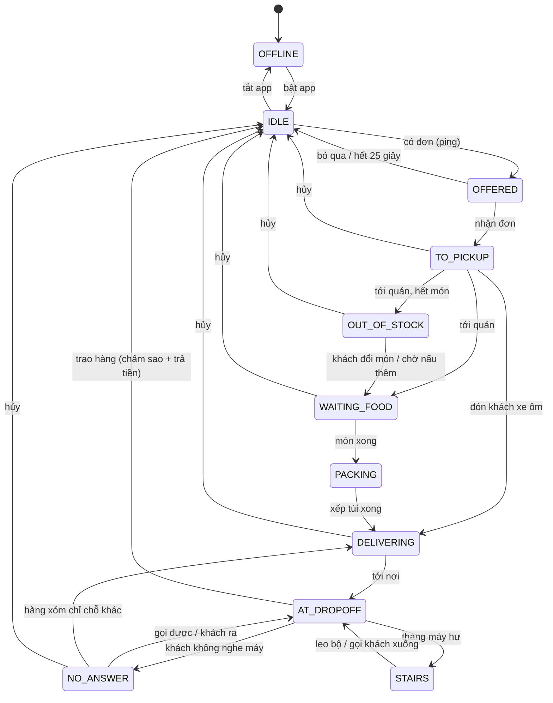

# Shipper Simulation – Tài liệu thiết kế (bản chơi được đầu tiên)

Bản mô tả gốc yêu cầu Unity/C#. Bản này làm **đúng các hệ thống đó bằng JavaScript + Three.js** (WebGL 2), chạy trong trình duyệt. File này thay cho 3 đầu việc của bản mô tả: (1) sơ đồ trạng thái + kiến trúc `OrderManager` / `DeliveryAppUI`, (2) lõi `ItemPhysics` + `OrderCondition`, (3) bảng chỉ số xe và túi.

---

## 1. Vòng chơi

```
Bật app → Có đơn (Y nhận / N bỏ) → Chạy tới quán → Chờ quán (xếp hàng / hết món)
→ Xếp túi (mini-game) → Chạy giao (ổ gà, kẹt xe, chó, CSGT, mưa) → Sự cố ở điểm giao
(địa chỉ mơ hồ, khách không nghe máy, thang máy hư) → Trao hàng → Chấm sao + Hóa đơn
```

- **Thắng:** trả đủ tiền nhà cho Cô Hai trước 22:00 (ngày 1: 400k, mỗi ngày sau +150k).
- **Thua:** điểm đánh giá < 4.0 (khóa tài khoản) · thể lực = 0 (ngất) · tinh thần = 0 (bỏ nghề) · 22:00 chưa trả tiền nhà.
- **Ràng buộc mở khóa:** xăng → mới chạy được · Túi giữ nhiệt → đơn trà sữa/kem · Mũ cho khách → đơn xe ôm → nhiệm vụ chiếc ví · Áo mưa → hết bị phạt khi mưa · tiền → xe tốt hơn.
- **Chuỗi manh mối:**
  - *Chiếc ví* (nhiệm vụ phụ): khách xe ôm bỏ quên ví → CMND ghi "cổng xanh, cạnh tạp hóa Cô Ba" → hỏi người đi đường → Cô Ba chỉ hẻm 42 → mẹ anh Minh nói anh ở quán cà phê → trả ví (+150k) **hoặc** lấy 300k (bị khiếu nại: −100k, thêm 3 đánh giá 1★).
  - *Địa chỉ mơ hồ:* chỉ có vòng tím → gọi khách hoặc hỏi người đi đường trong vòng để biết đúng nhà.
  - *Khách không nghe máy:* gọi lại / chờ / hỏi hàng xóm → khách đang ở chỗ khác → đổi điểm giao.

## 2. Máy trạng thái `OrderManager` (`src/sim/OrderManager.js`)



- Bảng chuyển hợp lệ nằm trong `TRANSITIONS`; chuyển sai sẽ báo lỗi (có bộ thử kiểm tra).
- Phát sự kiện: `offer`, `offerExpired`, `accepted`, `pickedUp`, `revealed`, `redirect`, `completed`, `cancelled`, `state`.
- Hoàn toàn **không phụ thuộc Three.js/DOM** → chạy được trong Node (bộ thử và bot mô phỏng dùng chính lớp này).

### `DeliveryAppUI` (`src/ui/phone.js`)
Điện thoại GoShip có 5 thẻ: **Đơn** (thẻ đơn mới có đếm ngược, các bước của đơn đang chạy, tình trạng từng món, nút Gọi khách / Hủy đơn) · **Bản đồ** (tên đường, kẹt xe, CSGT đã biết) · **Nhóm** (tin nhắn Hội Shipper: dự báo mưa, chốt CSGT, kẹt xe, mẹo) · **Ví** (thu/chi, đơn gần đây, điểm) · **Túi đồ**. Giao diện chỉ đọc ảnh chụp trạng thái và gửi hành động về `interactions.js`; không giữ logic.

## 3. Vật lý món hàng & chấm điểm

`src/sim/ItemPhysics.js`: mỗi `DeliveryItem` ghép các **đặc tính** (component):

| Đặc tính | Theo thời gian | Sự kiện từ xe |
|---|---|---|
| 🔥 Hot | nguội về nhiệt độ ngoài trời, hệ số `0.035·(1−0.8·giữ nhiệt)`; dưới 60°C mất điểm | – |
| ❄️ Cold | ấm lên theo nhiệt độ + nắng, hệ số `0.03·(1−giữ nhiệt)`; quá ngưỡng tan thì mất điểm | – |
| 💧 Liquid | – | xóc `12·mag·(1−0.7·giảm xóc)`, phanh `8·mag`, ôm cua `5·mag`, va chạm `15·mag`; ×2,5 nếu để nghiêng; đệm túi giảm 40% |
| ⚠️ Fragile | – | va chạm `28·mag`, xóc `5·mag`, phanh `4·mag`; đệm túi giảm 60%; bị đè khi xếp túi −30% |
| 📦 Paper | mưa mà túi không chống nước: −0,5%/phút | – |
| 🧍 Passenger | quá 40 km/h: `(v−11)·0,6`/phút; mưa không áo mưa | phanh `10·mag`, ôm cua `6·mag`, xóc, va chạm `30·mag` |

Bộ điều khiển xe (`src/world/controllers.js`) phát sự kiện: **bump** (ổ gà, lề đường, cầu thang), **brake** (giảm tốc > 6,5 m/s²), **swerve** (gia tốc ngang > 6 m/s²), **collision** (tường, xe, người, chó). Kết quả xếp túi gắn vào món: để đứng/nghiêng, sát món nóng/lạnh ngược chiều, bị đè.

`src/sim/OrderCondition.js`: **Số sao = 5 − phạt hàng − phạt trễ − khách khó tính − phạt khác** (làm tròn nửa xuống).

| Hàng còn | Phạt | | Thời gian / hạn | Phạt |
|---|---|---|---|---|
| ≥ 90% | 0 | | ≤ 100% | 0 |
| 75–90% | 0,5 | | ≤ 125% | 1 |
| 60–75% | 1,5 | | ≤ 150% | 2 |
| 40–60% | 2,5 | | > 150% | 3 |
| 25–40% | 3,5 | | | |
| < 25% | khách từ chối, 1★, 0 đồng | | | |

## 4. Kinh tế (`src/sim/economy.js`)

**Lãi thực = (Giá cước + Thưởng quãng đường) − Phí nền tảng 20% − Thuế 1,5% − Tiền xăng**, cộng tiền boa (4★: 3k, 5★: 8k). Tiền xăng đã trả ở cây xăng nên ví chỉ được cộng `cước − phí − thuế + boa`; hóa đơn vẫn hiện đủ công thức.

### Bảng xe

| Xe | Tốc độ tối đa | Tăng tốc | Phanh | Giảm xóc | Xăng (L/100 km) | Bình xăng | Giá |
|---|---|---|---|---|---|---|---|
| Cub cũ 50cc | 45 km/h | 4,2 m/s² | 9 | 20% | 3,5 | 3,0 L | có sẵn |
| Tay ga Vision | 60 km/h | 5,8 m/s² | 11 | 50% | 2,8 | 4,5 L | 1.200k |
| Mô tô 150cc | 79 km/h | 8,0 m/s² | 13 | 80% | 2,2 | 6,0 L | 3.500k |

Ví dụ: cùng một cú ổ gà ở 45 km/h, tô phở mất ~10% với Cub nhưng chỉ ~5% với mô tô.

### Bảng túi giao hàng

| Túi | Giữ nhiệt | Chống nước | Đệm chống sốc | Số ô | Giá | Mở khóa |
|---|---|---|---|---|---|---|
| Túi nylon | 0% | 0% | 0% | 2×2 | miễn phí | – |
| Túi giữ nhiệt | 55% | 50% | 25% | 3×2 | 120k | đơn trà sữa, kem |
| Thùng chuyên dụng | 80% | 100% | 55% | 3×3 | 380k | – |

Đồ nghề khác: Áo mưa 40k · Mũ bảo hiểm cho khách 50k (mở đơn xe ôm) · Áo khoác chống nắng 60k.

### Đo bằng mô phỏng (`npm run sim`, 300 ngày mỗi chiến thuật, ngày 1)

| Chiến thuật | Thắng | Giờ thắng TB | Đơn/ngày | Sao TB | Lãi/đơn | Điểm cuối |
|---|---|---|---|---|---|---|
| Cẩn thận (chạy chậm) | 51% | 20:41 | 12,2 | 4,39 | 36,6k | 4,58 |
| Ẩu (max ga) | 99% | 17:58 | 13,2 | 4,06 | 35,1k | 4,38 |
| Kén đơn gần | 15% | 17:05 | 5,2 | 4,47 | 38,3k | 4,70 |
| Bình thường (trả ví) | 81% | 19:59 | 12,5 | 4,49 | 36,8k | 4,63 |
| Tham (giữ tiền ví) | 86% | 19:03 | 11,1 | 4,48 | 36,8k | 4,18 |

Bot không mô phỏng va chạm, đi bộ, xếp túi sai nên người chơi thật sẽ chậm hơn bot. Giữ tiền trong ví nhanh hơn một chút nhưng điểm sát ngưỡng bị khóa: đó là một canh bạc.

## 5. Chướng ngại môi trường (`src/sim/hazards.js`)

Lập lịch theo seed cho cả ngày: **mưa** (chiều nào cũng có giông 14:00–15:30, sáng 35% mưa phùn: đường trơn, phanh kém, hộp giấy ướt) · **nắng gắt** 11–15h (kem tan, mệt nếu không có áo khoác) · **chốt CSGT** ở ngã tư bên trong, 40–60 phút/lần (qua chốt > 40 km/h bị phạt 150k; 70% được nhóm báo trước) · **kẹt xe** giờ cao điểm trên Hai Bà Trưng / Điện Biên Phủ (tối đa 11,5 km/h, trừ tinh thần) · **46 ổ gà** · **chó lao qua đường** (40% mỗi lần lại gần ở tốc độ cao).

## 6. Kiến trúc mã nguồn

```
src/
  data/       balance.js (MỌI con số cân bằng) · items.json · gear.json · places.json (sửa bằng ?editor)
              validate.js (kiểm tra dữ liệu, dùng chung cho công cụ và bộ thử)
  content/    vi.json — mọi chữ hiển thị; code gọi fmt(khóa, tham số)
  sim/        mô phỏng thuần, chạy được trong Node:
              OrderManager · ItemPhysics · OrderCondition · economy · hazards
              GameState (tiền, điểm, năng lượng, thắng/thua) · objectives · cityLayout · rng
  world/      Three.js: city (dựng phố, instancing) · controllers (xe, đi bộ, camera)
              traffic (xe NPC, người, chó, CSGT, kẹt xe) · sky (ngày–đêm, mưa) · models · textures · physics
  ui/         DOM: hud · phone (DeliveryAppUI) · modal · packing (xếp túi) · minimap · screens
  devtools/   autopilot (lái tự động cho kiểm thử, ?debug) · editor/ (công cụ nội dung ?editor)
  game.js     điều phối vòng lặp · interactions.js mọi hội thoại/thao tác · audio.js (Web Audio)
tests/        run.js (25 bộ thử luật) · economy-sim.js (bot chơi headless)
```

## 7. Giới hạn của bản đầu tiên

- Một quận 5×5 khối nhà; đường lưới, xe NPC không có đèn giao thông.
- Mỗi lúc chỉ nhận một đơn (chưa ghép đơn).
- Chưa có điều khiển cảm ứng cho điện thoại; chưa có lưu giữa ngày (lưu ở đầu mỗi ngày).
- Đồ họa low-poly bằng khối cơ bản, chưa có mô hình/âm thanh từ file.
